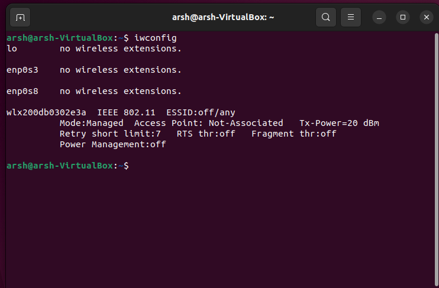
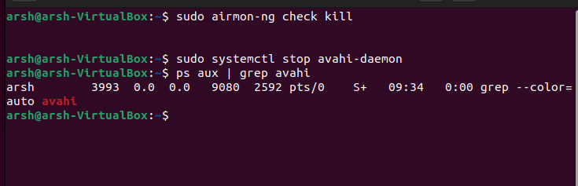
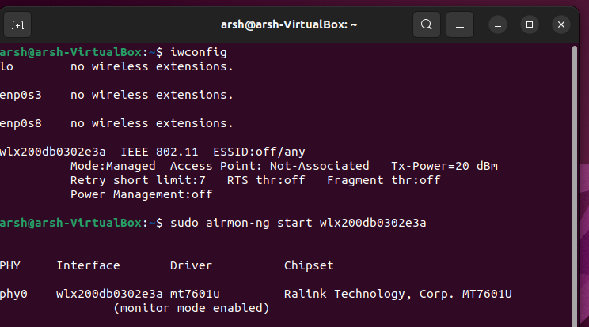
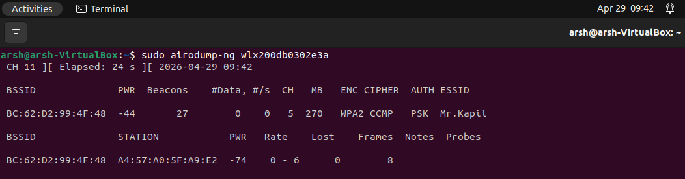
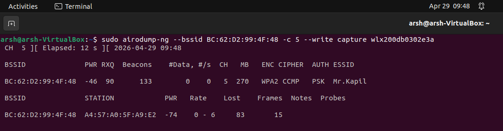
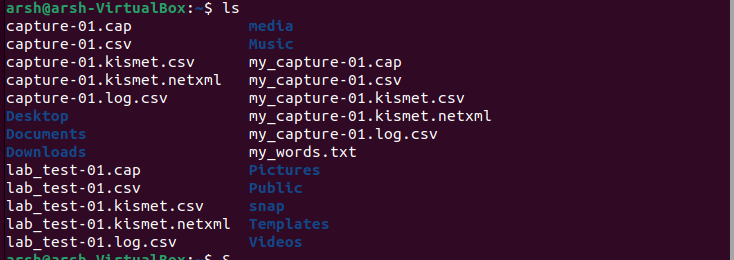
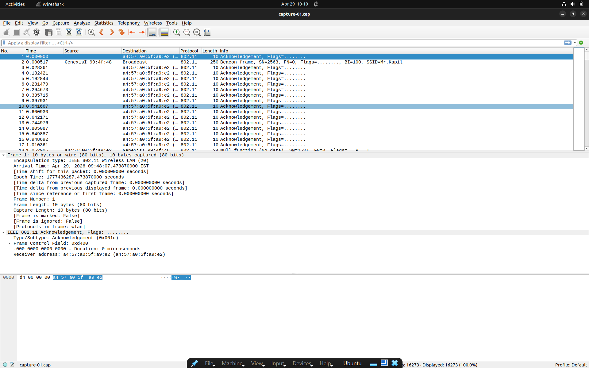

# 📡 Wi-Fi Security Audit & WPA2 Monitoring Lab

## 📌 Description

This project demonstrates a structured wireless security audit performed in a **controlled lab environment**.
It focuses on identifying wireless networks, capturing packets in monitor mode, and analyzing Wi-Fi communication using industry-standard tools.

---

## 🎯 Objective

* Understand wireless network behavior
* Perform packet capture using monitor mode
* Analyze Wi-Fi traffic and client activity
* Identify security risks in WPA2-PSK networks

---

## ⚙️ Tools & Technologies

* Ubuntu (Virtual Machine)
* Aircrack-ng Suite
* Wireshark
* USB Wi-Fi Adapter (MT7601U)

---

## 🧠 Lab Workflow

### 🔹 Step 1: Interface Detection

Used `iwconfig` to identify the wireless adapter.

```bash
iwconfig
```

📸 

---

### 🔹 Step 2: Process Cleanup

Stopped interfering services to enable monitor mode.

```bash
sudo airmon-ng check kill
sudo systemctl stop avahi-daemon
```

📸 

---

### 🔹 Step 3: Enable Monitor Mode

Enabled monitor mode for passive packet capture.

```bash
sudo airmon-ng start wlx200db0302e3a
```

📸 

---

### 🔹 Step 4: Network Scanning

Scanned nearby wireless networks and identified target network.

```bash
sudo airodump-ng wlx200db0302e3a
```

📸 

---

### 🔹 Step 5: Targeted Packet Capture

Captured packets from a specific network using BSSID and channel.

```bash
sudo airodump-ng --bssid BC:62:D2:99:4F:48 -c 5 --write capture wlx200db0302e3a
```

📸 

---

### 🔹 Step 6: Capture File Generation

Generated multiple output files including `.cap`, `.csv`, and `.kismet` formats for analysis.

📸 

---

### 🔹 Step 7: Packet Analysis (Wireshark)

Analyzed captured packets to understand wireless communication.

```bash
wireshark capture-01.cap
```

📸 

---

## 🔍 Observations

* Detected WPA2-PSK secured network
* Identified access point (BSSID) and connected client devices
* Observed beacon frames and acknowledgment frames
* Captured and analyzed real wireless traffic

---

## ⚠️ Risks Identified

* Security depends on password strength in WPA2-PSK
* Weak passwords are vulnerable to offline attacks
* Wireless communication exposes metadata such as MAC addresses

---

## 🛡️ Recommendations

* Use strong passwords (12+ characters)
* Upgrade to WPA3 if supported
* Disable WPS
* Regularly monitor connected devices

---

## ⚠️ Disclaimer

All testing was performed on a **controlled personal network** for educational purposes only.
No unauthorized networks were targeted.

---
